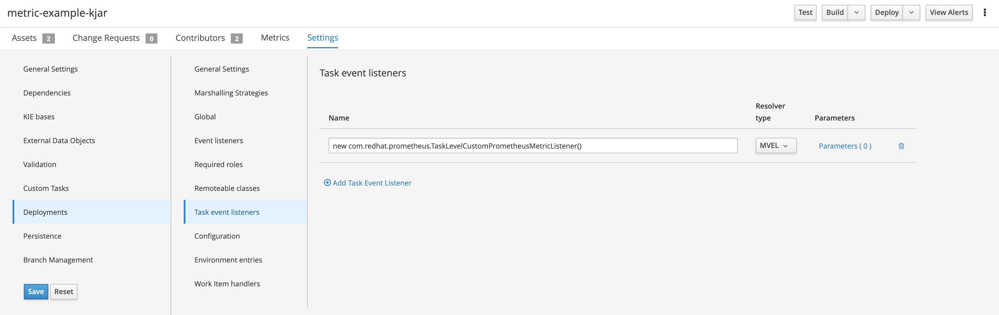

# springboot-pam-example

Example project for learning about RHPAM with Spring Boot Kieserver, Event listeners with custom metrics.

Basic Spring boot RHPAM project which includes a Event listeners to generate custom metrics.

Include the KJAR details [in](process-service/src/main/resources/application.yaml)

The KJAR (in this example https://github.com/rmuppane/metric-example-kjar.git) which we are deploying, create a eventlistner information in deployment descriptor.



Build the KJAR (https://github.com/rmuppane/metric-example-kjar.git) prior to start the spring-boot application.


Build the project `mvn clean install`

Navigate to process-service and run `mvn spring-boot:run`

Use Postman to check the default metrics:

GET
```
http://http://localhost:8090/rest/metrics
```

